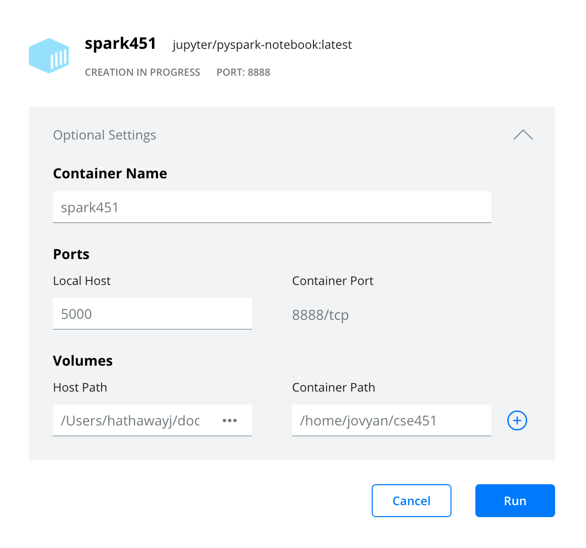

# Getting Started with Docker on Macintosh

## First Steps
1. [Create a Dockerhub account](https://hub.docker.com/signup)
   - Try to choose a professional sounding username: Our TA used JigglyNoahPuff... this was a bad choice
   - It is probable that you will end up using this account for some professional setting.
2. [Install Docker Desktop](https://www.docker.com/get-started)
   - Follow the link and download the version that matches your copmuter
   - Sign into Docker Desktop using the account you just created
   - Prepare yourself as things from here on get a little trickier
3. [Pull the jupyter/all-spark-notebook](https://hub.docker.com/r/jupyter/all-spark-notebook)
   - Open the command line interface of your choosing
     * Open it in adminstrator mode just in case
     * You are on Mac so it is most likely going to be terminal
     * You can also use a terminal inside of VSCode, JupyterLabs, or another IDE
   - Once you have your CLI of your choosing open copy and paste or type the folowing command into it and press enter/return:
     > docker pull jupyter/all-spark-notebook
   - This downloads the **image** to your computer
     * This is a copy of the base operating system and packages that everyone will use. This ensures that everyone is using the same system.
     * It also saves you the pain of downloading all of these individually. Trust me, Spark does not set up easily
     * For more information on what this is doing please read the introToDocker.md file.
     * If there are any errors make sure that you are signed into Docker, Docker is running, and you have an internet connection
     * If those do not help ask a classmate, TA, or the teacher.  Probably in that order, but you do you
4. Create a Docker Network
   - You should still have your CLI of choice open, if you closed it reopen it. 
     * Also, if you closed it, please do not do that again until everything is set up.
   - In your CLI copy and paste or type the folowing command and press enter/return:  
   - This creates a local network inside of docker that your containers will all run on and it lets them interact with one another.
5. Finishing Setting the Spark Container
   - The following command does a couple of things
     * "docker run --name spark -it"
       - Starts your Docker all-spark-notebook container
     * "-p 8888:8888 -p 4040:4040 -p 4041:4041"
       - Specifies which ports we want to allocate for this container
     * "-v C:/Users/hathawayj/git/BYUI451/docker_guide/data:/home/jovyan/data"
     * "-v C:/Users/hathawayj/git/BYUI451/docker_guide/scripts:/home/jovyan/scripts"
     * "-v C:/Users/hathawayj/git/BYUI451/docker_guide/scratch:/home/jovyan/scratch" 
       - These three map the pathway on the left to the pathway on the right
       - The pathway on the left of ':' is on your actual computer
       - The pathway on the right of ':' is what the computer inside the Docker container uses 
       - I have included the path "C:/Users/hathawayj/git/BYUI451/docker_guide/data" which you will need to change. The path to the right of ':' will stay the same
     * "--network n451"
       - This tells it to use the network we just created
     * "jupyter/all-spark-notebook"
       - This tells it which image to use
     * The '\' at the end of lines are to tell the CLI to treat it all as one command and not stop at the endline 
   - The full command is as follows:
     > docker run --name spark -it \  
     > -p 8888:8888 -p 4040:4040 -p 4041:4041 \  
     > -v C:/Users/hathawayj/git/BYUI451/docker_guide/data:/home/jovyan/data \  
     > -v C:/Users/hathawayj/git/BYUI451/docker_guide/scripts:/home/jovyan/scripts \  
     > -v C:/Users/hathawayj/git/BYUI451/docker_guide/scratch:/home/jovyan/scratch \  
     > --network n451 \  
     > jupyter/all-spark-notebook
   - There is a way to do this in Docker Desktop as well, but it is not as straightforward as the CLI method
     * Here is an example of what it would look like in Docker Desktop  
      
6. Now open [http://localhost:8888/lab](http://localhost:8888/lab?token=) and paste `?token=` plus the token shown at the end of the url.

