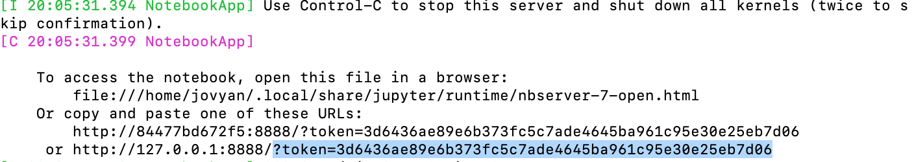
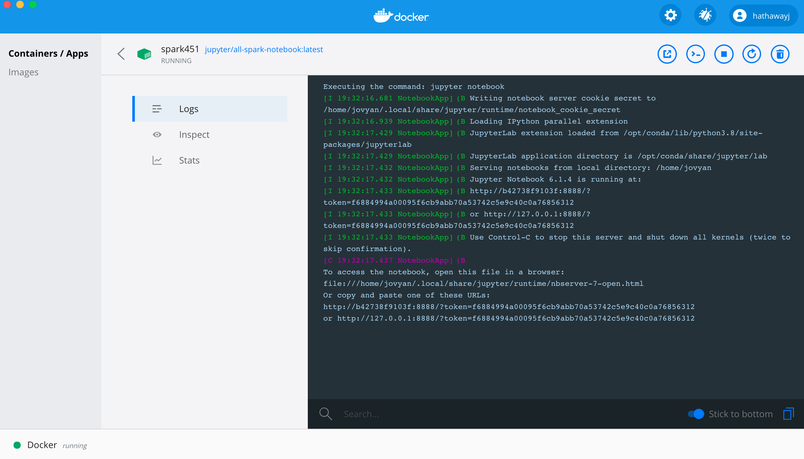

## Getting started using `docker run`

1. [Install Docker Desktop](https://www.docker.com/get-started) (Windows users will need to [install WSL-2](windows_wsl2.md).)
2. [Create a Dockerhub account](https://hub.docker.com/signup)
3. [Pull the jupyter/all-spark-notebook](https://hub.docker.com/r/jupyter/all-spark-notebook) `docker pull jupyter/all-spark-notebook`
4. Create a docker network `docker network create n451`
5. Start your Docker all-spark-notebook container - map to a folder path on your computer to a docker volume. I have included my path (`/Users/hathawayj/git/BYUI451/docker_guide/data`) which you will need to change. The path to the right of `:` will stay the same.``

We will see how to [create a Docker compose yaml](https://docs.docker.com/compose/) a little later. The Docker compose yaml includes a PostgreSQL and Adminer container as well.  You can read about creating those containers using `docker run` at [database.md](database.md). In trying to get all three containers to communicate, you will see the need for step 4 above.

_Note that the command line versions require that the full local volume path is specified. We will be able to use relative file paths with the yaml._

__Command Line: Mac__'"

```bash
docker run --name spark -it \
  -p 8888:8888 -p 4040:4040 -p 4041:4041 \
  -v /Users/hathawayj/git/BYUI451/docker_guide/data:/home/jovyan/data \
  -v /Users/hathawayj/git/BYUI451/docker_guide/scripts:/home/jovyan/scripts \
  -v /Users/hathawayj/git/BYUI451/docker_guide/scratch:/home/jovyan/scratch \
  --network n451 \
  jupyter/all-spark-notebook
```

__Command Line: Windows__

```bash
docker run --name spark -it ^
  -p 8888:8888 -p 4040:4040 -p 4041:4041 ^
  -v C:/git/BYUI451/docker_guide/data:/home/jovyan/data ^
  -v C:/git/BYUI451/docker_guide/scripts:/home/jovyan/scripts ^
  -v C:/git/BYUI451/docker_guide/scratch:/home/jovyan/scratch ^
  --network n451 ^
  jupyter/all-spark-notebook
```

__Docker Desktop__


6. Now open [http://localhost:8888/lab](http://localhost:8888/lab?token=) and paste `?token=` plus the token shown at the end of the url.

You can find the token in the terminal or in the logs.

| Terminal | Docker Desktop Logs |
|----------|---------------------|
| |  |

With `docker run` we can get a full Spark environment up and running on our computer in minutes. In this container, we can practice our Spark magic and even speed up some of the work we would do in pandas.  Spend some time in Jupyter Lab getting used to Spark. Here are some great links to help you with pyspark.

- [pyspark-examples](https://github.com/spark-examples/pyspark-examples)
- [PySpark Cheat Sheet](https://s3.amazonaws.com/assets.datacamp.com/blog_assets/PySpark_SQL_Cheat_Sheet_Python.pdf)
- [PySpark SQL Cheat Sheet](https://intellipaat.com/mediaFiles/2019/03/PySpark-SQL-cheat-sheet.jpg)

You could try using the [master files](https://www.irs.gov/charities-non-profits/exempt-organizations-business-master-file-extract-eo-bmf) from the United States IRS 990 forms about non-profit companies. Find the four region `.csv` files and explore.
## Getting started using `docker-compose`

To use this section, I am assuming the following.

- You have cloned your template repo to your local computer.
- You have a terminal open at the file path of this cloned repo.
- You have reviewed the [database.md](database.md) guide on the postgresql and Adminer containers.
- You have examined the [docker-compose.yml](docker-compose.yml) file.

We can create a docker compose `.yml` that automates a bit of the work we went through above. Once the `.yml` is created, we can simply tell `docker-compose` to build our docker containers. Here are the steps

1. Clone this repository to your computer.
2. Open your terminal and navigate to your git repo directory you just cloned. (Mac: `pwd`, Windows:`cd` to see your working directory)
3. If your terminal is open in the git directory, you can run the `docker-compose`.  The full command - `docker-compose -p c451 -f docker-compose.yml up`.

One difference is that each docker container will now have new names. 

| docker-compose name     | docker run name     | 
| ----------------------- | ------------------- | 
| _db_451_                | db                  | 
| _spark_451_             | spark               | 
| _adminer_451_           | adminer             | 

With these new names a few commands and inputs will need to be updated.  For example, to get into the new postgres container we would run `docker exec -it db_451 sh`.

## Other readme.md files

- [Postgres database Docker support](database.md)
- [Docker CLI and psql](command_line_containers.md)
- [Spark Guide using our Docker containers](https://github.com/BYUI451/spark_guide)
